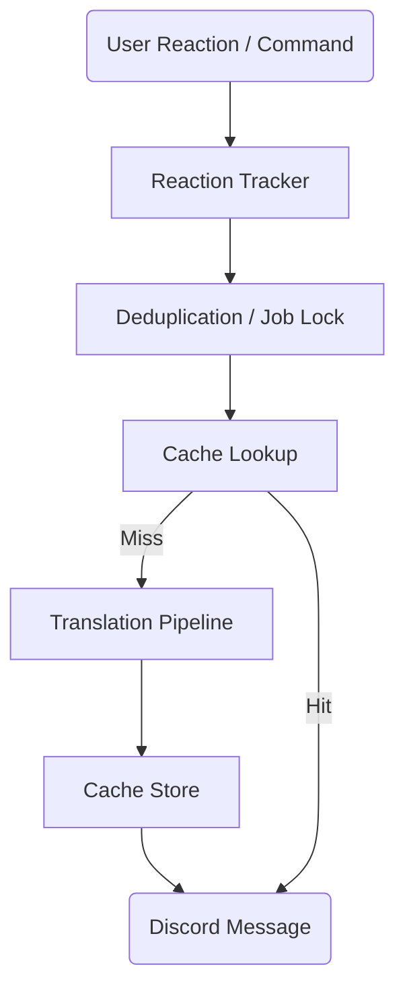

# Architecture

## System Overview
SmartTranslate uses a multi-stage pipeline architecture to handle translation requests reliably and efficiently.

## Translation Pipeline
The translation process is broken down into a 10-stage pipeline:
1. **PREPROCESS**: Trims text and checks length constraints.
2. **DETECT**: Multi-layer language detection (English, Devanagari Hindi, Roman Hindi, Hinglish, Mixed).
3. **VALIDATE**: Ensures the target language is different from the source language.
4. **NORMALIZE**: Applies rules to clean up Hinglish/Roman Hindi before translation.
5. **TOKENIZE**: Protects mentions, links, emojis, and formatting by replacing them with placeholders.
6. **CACHE CHECK**: Looks up the tokenized text in the LRU cache.
7. **TRANSLATE**: Routes the request to the active translation provider (Gemini or Azure).
8. **RESTORE**: Replaces placeholders with the original protected tokens.
9. **POSTPROCESS**: Final text cleanup and trimming.
10. **CACHE STORE**: Saves the final result in the cache for future requests.

## Language Detection
- Multi-layer strategy analyzing character scripts (Latin vs Devanagari).
- Uses a Hindi lexicon and English indicators for disambiguation.
- Employs code-mixing heuristics to identify Hinglish.
- Generates a confidence score to guide the pipeline.

## Hinglish Normalization
- **Purpose**: Cleans up informal chat text (e.g., expanding abbreviations, correcting common Hinglish typos).
- **Rule Categories**: Vowel standardization, slang expansion, punctuation cleanup.
- **Confidence Tracking**: Normalization passes track confidence to ensure meaning isn't lost.

## Provider System
- Implements a unified `TranslationProvider` interface.
- **Gemini (Primary)**: Chosen for its superior understanding of context and conversational Hinglish.
- **Azure (Fallback)**: Uses a robust 2-step pipeline (transliteration followed by translation).
- **Provider Router**: Features a circuit breaker pattern. If Gemini fails consecutively, it opens the circuit and falls back to Azure.

## Reaction Lifecycle
- **Add Reaction**: User reacts, the Reaction Tracker intercepts, acquires a lock (to prevent duplicates), and processes the translation.
- **Remove Reaction**: Can optionally delete the translation if the server setting `deleteOnReactionRemove` is enabled.
- **Multi-user deduplication**: Concurrent reactions for the same message and target language wait on the same job lock.

## Caching Strategy
- **Key Generation**: SHA-256 hash of `processedText + sourceLanguage + targetLanguage`.
- **LRU Eviction**: Bounded cache size to prevent memory leaks.
- **TTL Expiration**: Entries expire after a configurable duration.

## Rate Limiting
- **Per-User**: Limits translations per individual user within a sliding window.
- **Per-Guild**: Limits overall translations per server within a sliding window.

## Token Protection
- Identifies Discord mentions (`<@id>`), channels (`<#id>`), emojis, URLs, and code blocks.
- Replaces them with alphanumeric placeholders during translation to prevent the AI from altering them.
- Restores them perfectly post-translation.

## Database Schema
Stores configuration locally using SQLite:
- `guild_settings`: Guild-level preferences (enabled, allowHindi, maxMessageLength).
- `channel_settings`: Overrides for specific channels.
- `translation_mappings`: Maps source message IDs to their translated message IDs for lifecycle management.

## Error Handling
- **Provider Failures**: Triggers circuit breaker and fallback mechanisms.
- **Discord API Errors**: Graceful degradation (e.g., if message sending fails).
- Failsafe fallbacks ensure the bot doesn't crash on unhandled promise rejections.
